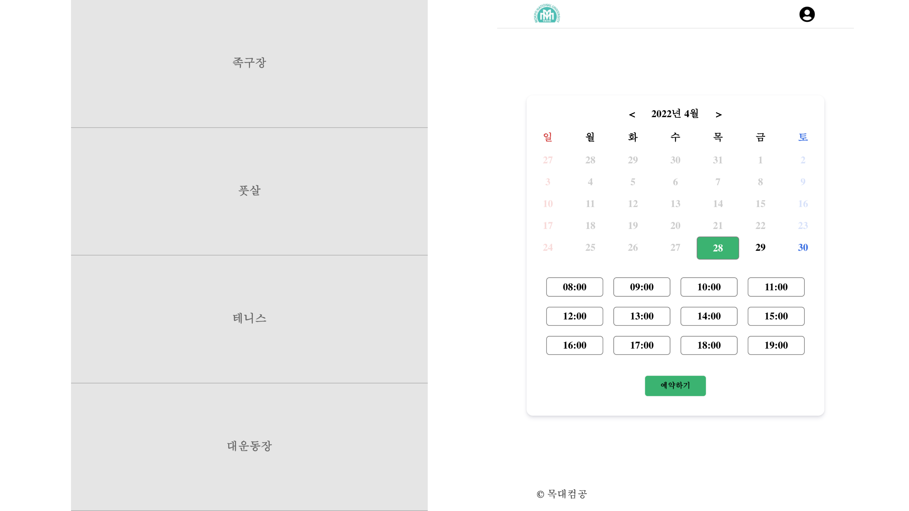

# 학교 시설 예약 프로그램

- ## 프로젝트 추진 배경

현재 교내에서의 여러 시설물의 예약 관리시스템의 대부분이 수기로 작성되어 진행되어 웹 서비스로 대체하기 위한 필요성을 느껴 프로젝트 진행했습니다.


- ## 사용 방법

>현재 관리자 UI부분이 완성되지 않아 추후에 오픈할 예정입니다.


#### 사용 방법에는 이용자와 관리자가 있다.

## 이용자

### 1. 홈

>시설 목록을 보여주고 시설을 선택하면 선택 가능한 시간을 보여준다.




### 2. 예약

> 날짜 및 시간을 선택해 예약한다.
>
> 예약 신청 / 예약 조회  / 예약 취소 / 시간별 예약 가능 보기 / 회원 별 예약 목록 보기


### 3. 로그인 및 예약 세부내용

> 로그인이 안되있는 이용자면 로그인 화면이로, 로그인 된 이용자면 예약 세부내용을 보여준다.
>
> 회원가입 / 로그인 / 정보 조회 / 정보 수정 /회원 탈퇴 


### 4. 예약 내역 및 마이페이지

> 예약한 내역과 개인정보를 수정할 수 있다.


## 관리자

### 1. 로그인 및 관리 홈


### 2. 예약 관리

> UI 준비중. 예약 조회  / 예약 취소

### 3. 시설관리


> UI 준비중, 조회 / 등록 / 수정 / 삭제 / 시설별 예약 리스트 보기

### 4. 사용자 관리

> UI 준비중, 사용자 리스트 보기, 사용자별 예약 리스트 보기, 사용자 정보 보기, 사용자 정보 수정, 사용자 탈퇴 

### 5. 내 계정

> UI 준비중, 정보 조회 / 정보 수정 / 탈퇴


- ## Project Structure

React(SPA) + Spring Boot(API Server) 구조로 구현했으며, API Server 를 담당했습니다.

사용한 기술 스택은 아래와 같고 학습하며  [블로그](https://iyk2h.tistory.com/category/Spring) 를 정리했습니다.
Spring Boot, Spring JPA, PostSQL, AWS(infra), Nginx, Jekins & Codedeploy (CI/CD),


> Swagger 를 사용해 API 명세화 했습니다. [링크](http://3.94.44.116:8080/swagger-ui/index.html#/) 서버가 종료되어 작동하지 않을 수 있습니다.
>
> [이미지](Documents/api/api_list.md) 


``` html 
<details>
	<summary>접기/펼치기</summary>
  
  
</details>
```


- ## 기능 목록

#### [사용자]

[사용자] 회원가입 / 로그인 / 정보 조회 / 정보 수정 /회원 탈퇴 

[시설] 조회(main home)

[시설 예약] 예약 신청 / 예약 조회  / 예약 취소 / 시간별 예약 가능 보기 / 회원 별 예약 목록 보기

#### [관리자]

[관리자] 관리자등록 / 로그인 / 정보 조회 / 정보 수정 / 탈퇴

[시설 관리] 조회 / 등록 / 수정 / 삭제 / 시설별 예약 리스트 보기

[예약 관리] 예약 조회  / 예약 취소

[사용자 관리] 사용자 리스트 보기, 사용자별 예약 리스트 보기, 사용자 정보 보기, 사용자 정보 수정, 사용자 탈퇴 


- ## 개발 환경

#### [Back-end ]

- vscode
- Spring Boot 2.5.4
- Java 11
- Maven
- Jar packages
- PostgreSQL

#### [[Front-end]](https://github.com/iyk2h/booking_service_front)

- vscode
- React


- ## 명세서


#### [사용자 예약 로직 명세서](../masterd/Documents/student_booking_api.md)

사용자 로그인, 로그아웃, 예약 가능 리스트 보기, 예약하기, 사용자가 예약한 목록 보기, 사용자가 예약한 예약 삭제


#### [사용자 로직 명세서](../master/Documents/student_api.md)

로그인, 로그아웃, 회원가입, 회원 id로 조회, 회원 정보 수정, 회원 탈퇴


