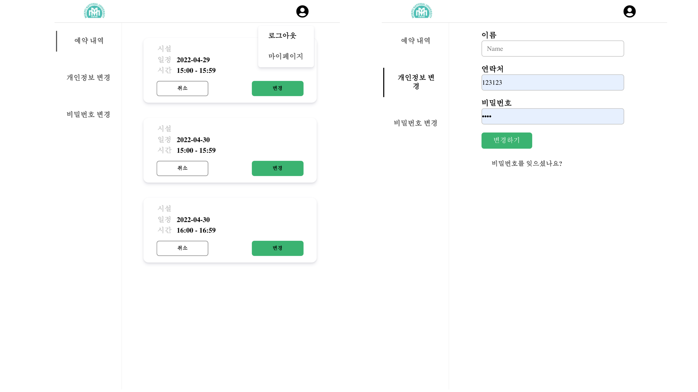

# 학교 시설 예약 프로그램

## 프로젝트 추진 배경

현재 교내에서의 여러 시설물의 예약 관리시스템의 대부분이 수기로 작성되어 진행되어 웹 서비스로 대체하기 위한 필요성을 느껴 프로젝트 진행했습니다.


## 사용 방법

>현재 관리자 UI부분이 완성되지 않아 추후에 오픈할 예정입니다.


#### 사용 방법에는 이용자와 관리자가 있다.

## 이용자

### 1. 홈

>시설 목록을 보여주고 시설을 선택하면 선택 가능한 시간을 보여준다.
>
>시설 조회(main home) / 예약 신청


### 2. 예약

> 날짜 및 시간을 선택해 예약한다.
>
> 예약 신청 / 예약 조회  / 예약 취소 / 시간별 예약 가능 보기 / 회원 별 예약 목록 보기


### 3. 로그인 및 예약 세부내용

> 로그인이 안되있는 이용자면 로그인 화면이로, 로그인 된 이용자면 예약 세부내용을 보여준다.
>
> 회원가입 / 로그인 


### 4. 예약 내역 및 마이페이지

> 예약한 내역과 개인정보를 수정할 수 있다.
>
> 정보 조회 / 정보 수정 /회원 탈퇴 




## 관리자

### 1. 로그인 및 관리 홈

> 회원가입 / 로그인


### 2. 예약 관리

> UI 준비중. 예약 조회  / 예약 취소


### 3. 시설관리


> UI 준비중, 조회 / 등록 / 수정 / 삭제 / 시설별 예약 리스트 보기

### 4. 사용자 관리

> UI 준비중, 사용자 리스트 보기, 사용자별 예약 리스트 보기, 사용자 정보 보기, 사용자 정보 수정, 사용자 탈퇴 

### 5. 내 계정

> UI 준비중, 정보 조회 / 정보 수정 / 탈퇴


## Project Structure

##### 이번 프로젝트에서 API Server / Infra / 기획 / 설계 / 일정관리 를 담당했습니다.

React(SPA) + Spring Boot(API Server) 구조로 구현했으며, API Server 를 담당했습니다.

사용한 기술 스택은 아래와 같고 학습하며  [블로그](https://iyk2h.tistory.com/category/Spring) 를 정리했습니다.
- Spring Boot
- JPA
- AWS(infra)
- Nginx
- Jekins & Codedeploy (CI/CD)

> Swagger 를 사용해 API 명세화 했습니다. [링크](http://3.94.44.116:8080/swagger-ui/index.html#/) 서버가 종료되어 작동하지 않을 수 있습니다.
>
> [Swagger 이미지](Documents/api/api_list.md) 


## 개발 환경

#### Backend

- Spring Boot
- Java 11
- JPA
- Maven

#### DevOps

- AWS - EC2, S3
- PostgreSQL
- Jenkins
- Nginx, Tomcat

#### Tools

- vscode
- Git


## Spring Boot

React 와 JSON으로 통신

### 구조

- config : swagger 및 webConfig 관리한다.
- controller : 클라이언트와 연결되는 부분으로 API를 관리한다.
- dto : controller 와 service 에서의 request/response 를 관리한다.
- entity : service 와 DataBase 에서의 request/response 를 관리한다. 
- filter : 관리자용 url 권한을 관리한다.
- mapper : dto 와 entity를 맵핑해준다.
- repository : JPA/QueryDSL를 관리한다.
- service : 비지니스 로직을 관리한다.


## JPA

``` java
Booking findByBno(Integer bno);
List<Booking> findByFacility(Facility facility);
List<Booking> findByStudents(Students students);

//booking list from Date
List<Booking> findAllByStartTimeBetween(LocalDateTime startTime, LocalDateTime endTime);

//booking list from Date with fno
@Query(value = "select b from Booking AS b where b.facility= ?1 and b.startTime between ?2 and ?3 order by b.startTime")
List<Booking> findAllByFacility(Facility facility, LocalDateTime startTime, LocalDateTime endTime);
@Query(value = "select b from Booking AS b where b.students= ?1 and b.bno= ?2")
Booking findBySidBno(Students students, Integer bno);
```

- ##### PostSQL (DBMS)


## AWS(infra), Nginx, Jekins & Codedeploy (CI/CD)


## 느낀점 및 아쉬운점

1. 혼자 배포하고 테스트 하다보니 테스트코드를 작성하지 않은 부분
1. OAuth2.0 + JWT 미사용
1. 작은 오류 + 배포후 피드백을 받지 못하는 부분

다음 프로젝트에선 JUnit(Test), OAuth2.0 + JWT 사용 

추가로 Redis, Spring Batch 도 사용해보면 좋을 것 같다.
